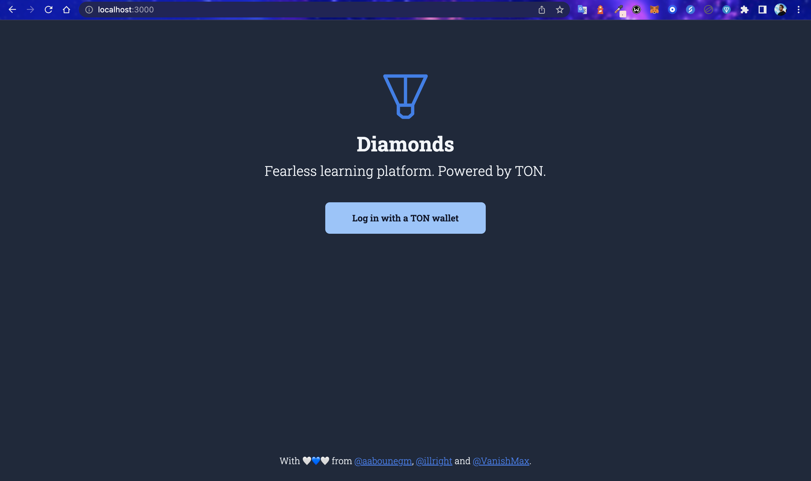
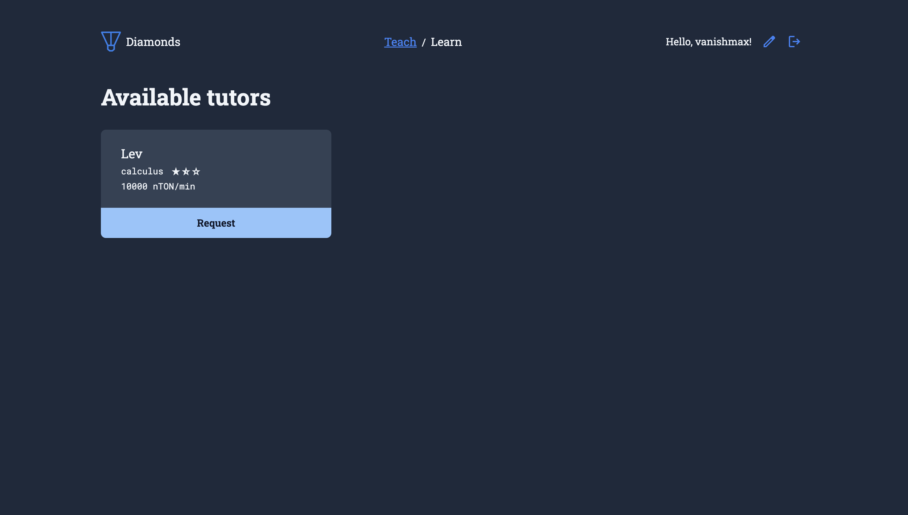
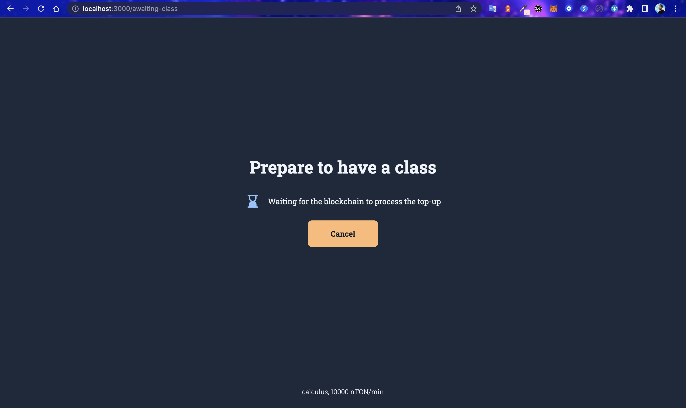
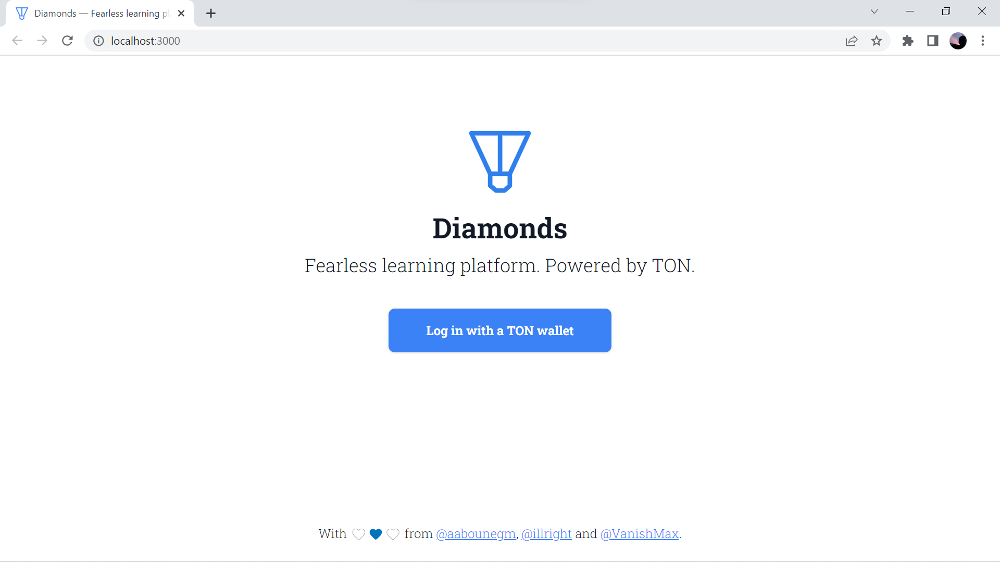
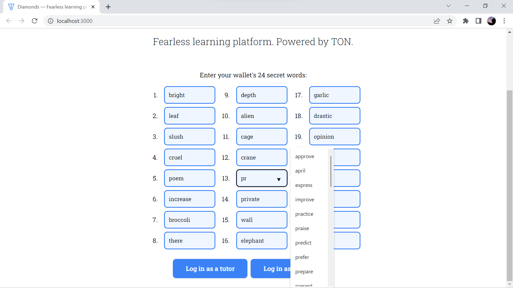
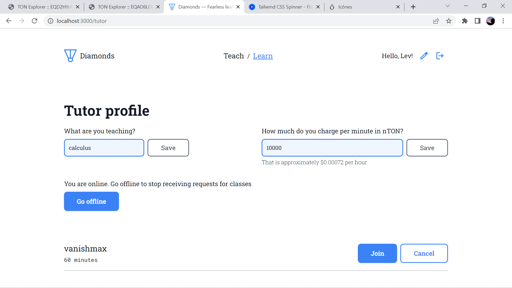

<a href="https://diamonds-ton.vercel.app/" target="_blank">
    
</a>


## Features

- 🧑‍🎓 Learn valuable knowledge from the best
- 🧑‍🏫 Share your knowledge and get fairly paid
- 🗣 Establish trustful communication without any platform commissions
- 🌐 Peer-to-peer communication and blockchain technologies make the platform decentralized
- 💎 Powered by TON


<details>
  <summary><strong>Screenshots from the Student POV</strong></summary>
  <table>
    <tbody>
      <tr>
        <td></td>
        <td></td>
        <td></td>
      </tr>
    </tbody>
  </table>
</details>


<details>
  <summary><strong>Screenshots from the Tutor POV</strong></summary>
  <table>
    <tbody>
      <tr>
        <td></td>
        <td></td>
        <td></td>
      </tr>
    </tbody>
  </table>
</details>

## Running locally

Run it like any other Node.js app, first the dependencies, then the `dev` script:

```bash
pnpm install
pnpm dev
```

## Meet the team

<table>
  <thead>
    <th><a href="https://github.com/aabounegm">@aabounegm</a></th>
    <th><a href="https://github.com/illright">@illright</a></th>
    <th><a href="https://github.com/VanishMax">@VanishMax</a></th>
  </thead>
  <tbody align="center"><tr>
    <td></td>
    <td></td>
    <td></td>
  </tr></tbody>
</table>

## License

The source code of this project is distributed under the terms of the MIT license. [Click here](https://choosealicense.com/licenses/mit/) to learn what that means.
